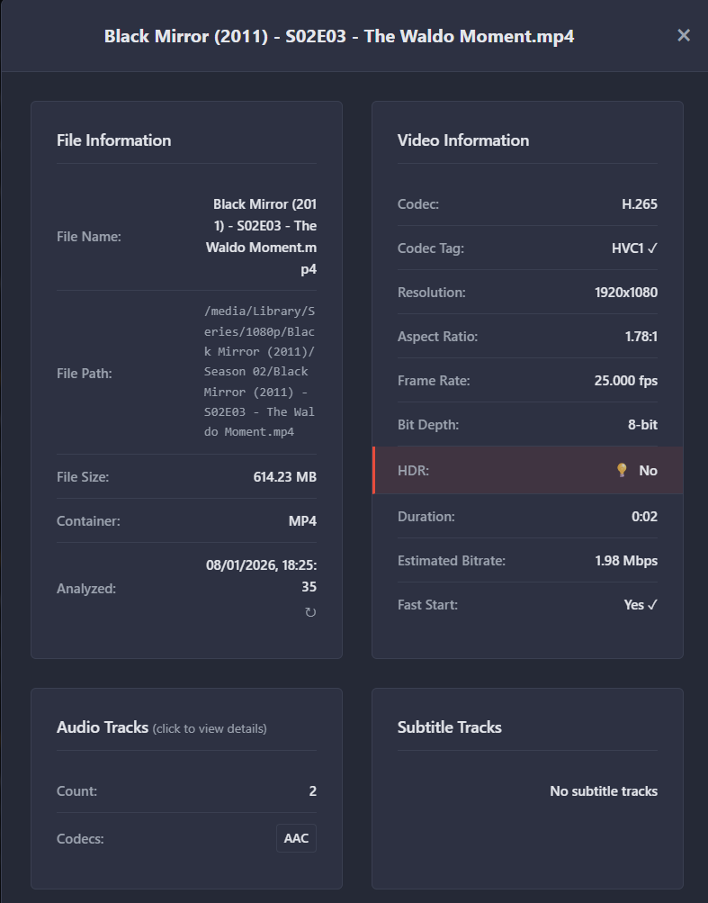

# Optimarr - Media Optimization

A web-based application for analyzing video files to determine their compatibility based on media properties. Built in the Servarr family style with integration support for Sonarr, Radarr, and Jellyfin.

## ⚠️ Disclaimer

**This software is in early development stage. Use it at your own risk. The developers are not responsible for any data loss, system damage, or other issues that may arise from using this software. Always backup your data before installation and use.**

## Features

- **Video Analysis**: Analyze video files based on media properties (codecs, containers, bit depth, HDR, etc.)
- **Compatibility Rating**: 0-100 rating scale with configurable thresholds and impact weights
- **Library Management**: Scan and manage multiple video libraries with background processing
- **Servarr Integration**: Sonarr, Radarr, and Jellyfin integration for automated analysis and redownloads
- **Tdarr Webhook**: Automatic rescan after transcoding
- **Modern Web UI**: Servarr-style dark theme interface

## Installation

**Docker Hub Image:** `bridgemill/optimarr:latest`

### Quick Start (Docker Compose)

1. Clone this repository
2. Edit `docker-compose.yml` to configure volumes
3. Start the container:
   ```bash
   docker-compose up -d
   ```
4. Open `http://localhost:5000`

### Docker Run

```bash
docker pull bridgemill/optimarr:latest

docker run -d \
  --name optimarr \
  -p 5000:8080 \
  -v $(pwd)/config:/app/config \
  -v $(pwd)/data:/app/data \
  -v $(pwd)/logs:/app/logs \
  -v $(pwd)/videos:/videos:ro \
  --restart unless-stopped \
  bridgemill/optimarr:latest
```

## Documentation

- **[Product Requirement Document](docs/PRD.md)** - Product specifications and requirements
- **[System Architecture](docs/ARCHITECTURE.md)** - Technical architecture and design
- **[Developer Guide](docs/DEVELOPER_GUIDE.md)** - Development workflows and patterns
- **[Changelog](docs/CHANGELOG.md)** - Version history

## Screenshots




## Support

For issues and questions, please open an issue on the project repository.

---

**License:** MIT License
